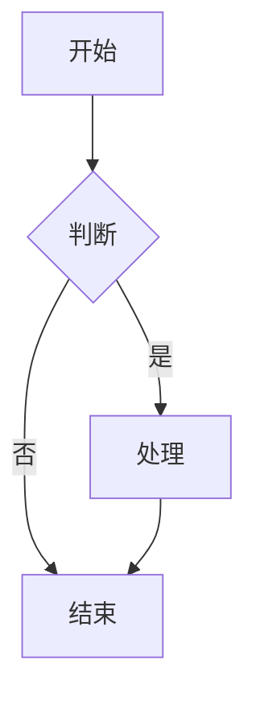
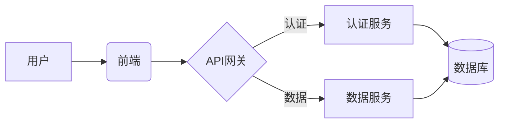
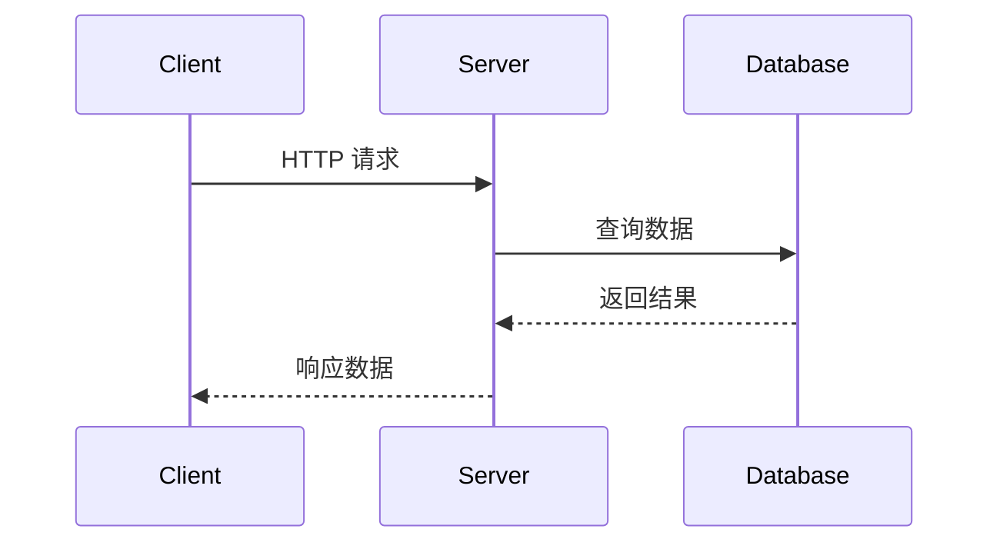
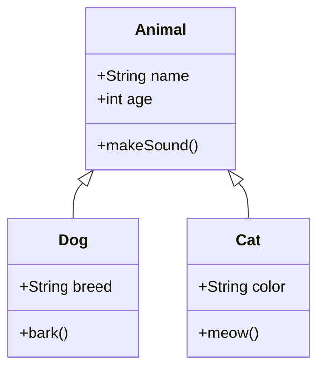
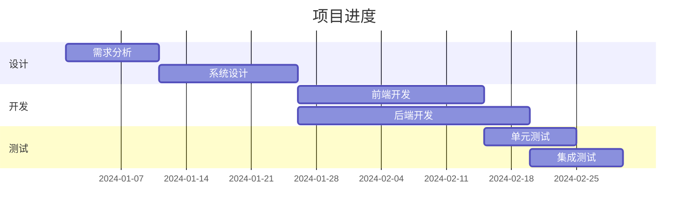

# Mermaid 图表插件

Mermaid 插件用于在文档中渲染各种类型的图表。

## 使用方法

使用 ```mermaid 代码块来定义图表：

```markdown

```

## 配置

在配置文件中启用 Mermaid 插件：

```toml
[plugins]
mermaid = true
```

## 图表类型

### 流程图



### 时序图



### 类图



### 甘特图


