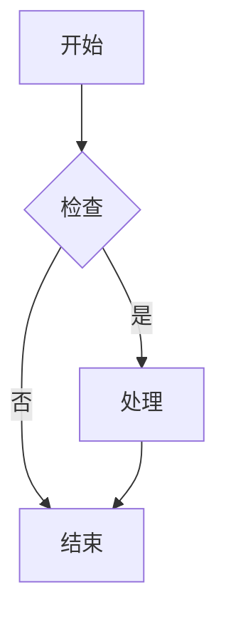

# nargo-document 示例文档

这是一个使用 nargo-document 的示例文档。

## 快速开始

### 安装

```bash
cargo install nargo-document
```

### 基本使用

```bash
# 生成 HTML 文档
nargo-document generate --format html --output ./docs

# 启动开发服务器
nargo-document serve --port 8080
```

## 插件示例

### 数学公式

行内公式：$E = mc^2$

块级公式：
$$
\int_{-\infty}^{\infty} e^{-x^2} dx = \sqrt{\pi}
$$

### 图表



### 代码高亮

```rust
fn main() {
    println!("Hello, nargo-document!");
    
    let numbers = vec![1, 2, 3, 4, 5];
    let sum: i32 = numbers.iter().sum();
    
    println!("Sum: {}", sum);
}
```

```typescript
interface User {
    id: number;
    name: string;
    email: string;
}

async function getUser(id: number): Promise<User> {
    const response = await fetch(`/api/users/${id}`);
    return response.json();
}
```

### 自定义容器

:::tip
这是一个提示信息，用于展示有用的建议。
:::

:::warning
请注意，这个功能可能会在未来的版本中发生变化。
:::

:::danger
此操作不可逆，请谨慎执行！
:::

:::info
更多信息请参考官方文档。
:::

## 表格示例

| 功能 | 描述 | 状态 |
|------|------|------|
| HTML 生成 | 生成静态 HTML 文档 | ✅ |
| Markdown 渲染 | 支持完整的 Markdown 语法 | ✅ |
| PDF 导出 | 导出为 PDF 格式 | ✅ |
| 插件系统 | 支持 KaTeX、Mermaid 等 | ✅ |
| 主题定制 | 自定义主题和样式 | ✅ |

## 列表示例

### 无序列表

- 项目一
- 项目二
- 项目三
  - 子项目 A
  - 子项目 B

### 有序列表

1. 第一步
2. 第二步
3. 第三步
   1. 子步骤 1
   2. 子步骤 2

## 引用示例

> 这是一段引用文本。
> 
> 可以包含多行内容。
> 
> —— 某位名人

## 链接示例

- [nargo 项目](https://github.com)
- [VuTeX 文档](https://github.com)

## 图片示例


---

感谢使用 nargo-document！
