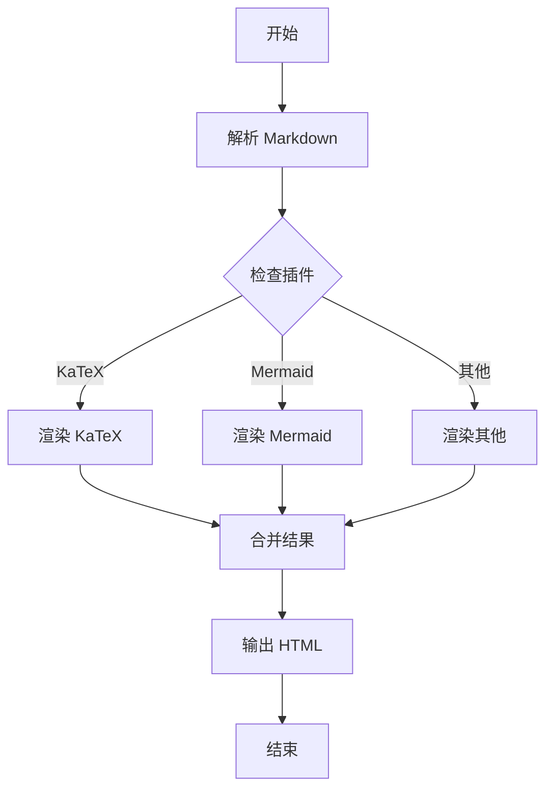
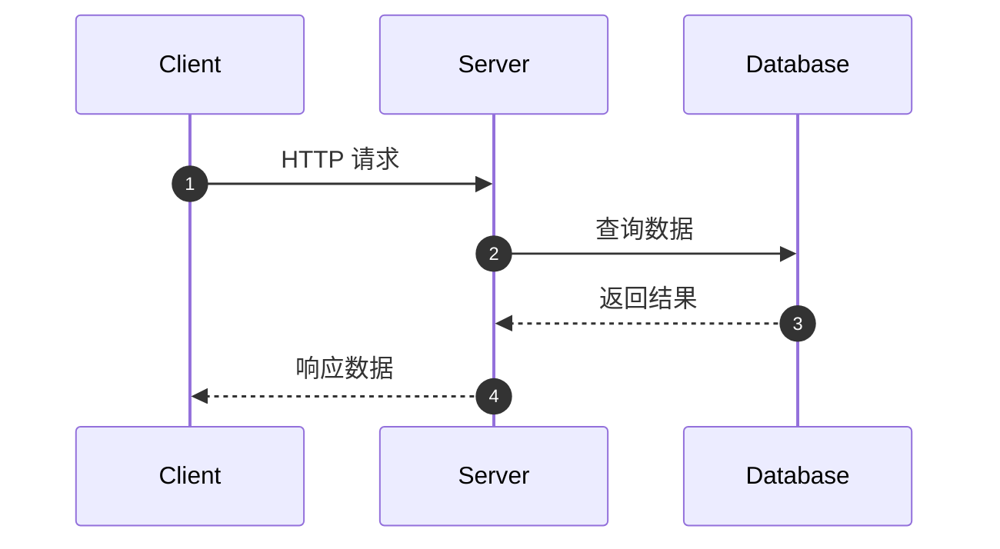
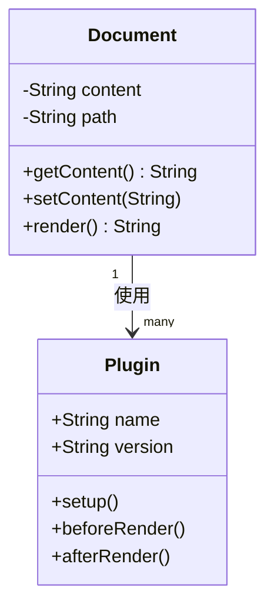
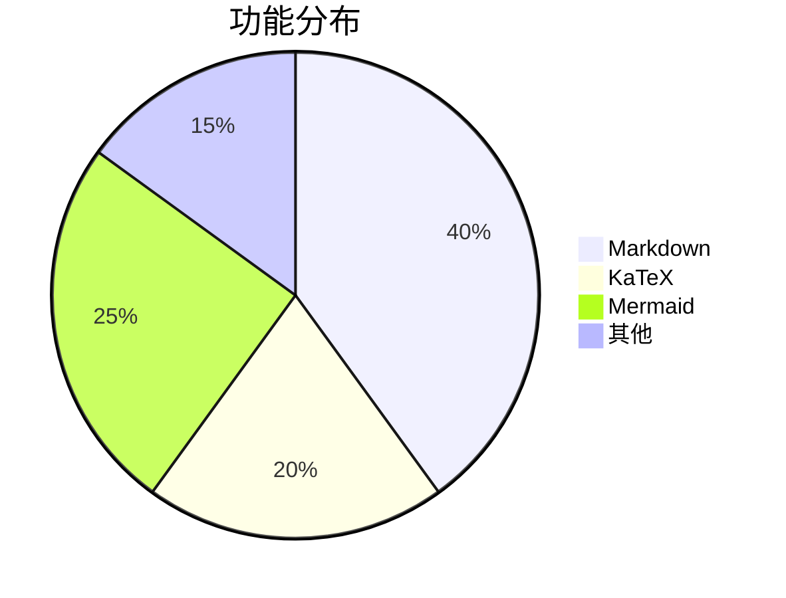

# VuTeX 兼容性测试文档

本文档用于测试 nargo-document 对 VuTeX 格式的兼容性。

---

## Frontmatter 测试

```markdown
---
title: 测试文档
description: 这是一个测试文档
date: 2024-01-01
author: 测试作者
tags: [测试, 兼容性]
layout: page
sidebar: true
---
```

---

## 标准 Markdown 语法

### 文本样式

- **粗体文本**
- *斜体文本*
- ~~删除线文本~~
- ==高亮文本==

### 列表

#### 无序列表

- 项目一
- 项目二
  - 子项目 A
  - 子项目 B
- 项目三

#### 有序列表

1. 第一项
2. 第二项
   1. 子项一
   2. 子项二
3. 第三项

#### 任务列表

- [x] 已完成的任务
- [ ] 待完成的任务
- [ ] 另一个待完成的任务

### 链接和图片

[链接文本](https://example.com)


### 引用

> 这是一段引用文本
> 
> 可以有多行
> 
> —— 引用来源

### 表格

| 功能 | 描述 | 状态 |
|------|------|------|
| HTML 生成 | 生成静态 HTML | ✅ |
| Markdown 渲染 | 支持完整语法 | ✅ |
| 插件系统 | KaTeX、Mermaid 等 | ✅ |

---

## 代码高亮

### JavaScript

```javascript
function greet(name) {
    return `Hello, ${name}!`;
}

console.log(greet('World'));
```

### TypeScript

```typescript
interface User {
    id: number;
    name: string;
    email: string;
}

async function getUser(id: number): Promise<User> {
    const response = await fetch(`/api/users/${id}`);
    return response.json();
}
```

### Rust

```rust
fn main() {
    let numbers = vec![1, 2, 3, 4, 5];
    let sum: i32 = numbers.iter().sum();
    
    println!("Sum: {}", sum);
}
```

---

## 数学公式

### 行内公式

行内公式：$E = mc^2$ 和 $f(x) = x^2 + 2x + 1$

### 块级公式

$$
\sum_{i=1}^{n} i = \frac{n(n+1)}{2}
$$

$$
\int_{-\infty}^{\infty} e^{-x^2} dx = \sqrt{\pi}
$$

$$
\begin{pmatrix}
1 & 2 & 3 \\
4 & 5 & 6 \\
7 & 8 & 9
\end{pmatrix}
$$

---

## 图表

### 流程图



### 时序图



### 类图



### 饼图



---

## 自定义容器

### Tip 提示

::: tip
这是一条提示信息。
:::

::: tip 自定义标题
这是带自定义标题的提示。
:::

### Warning 警告

::: warning
这是一条警告信息，请注意。
:::

### Danger 危险

::: danger
这是一条危险警告，请谨慎操作。
:::

### Info 信息

::: info
这是一条信息。
:::

---

## 脚注

这是一个带有脚注的文本[^1]。

另一个脚注示例[^2]。

[^1]: 这是第一个脚注的内容。
[^2]: 这是第二个脚注的内容，可以包含更多细节。

---

## 总结

本文档测试了 VuTeX 和 nargo-document 之间的主要兼容性特性，包括：

- ✅ Frontmatter 元数据
- ✅ 标准 Markdown 语法
- ✅ 代码高亮
- ✅ 数学公式（KaTeX）
- ✅ 图表（Mermaid）
- ✅ 自定义容器
- ✅ 脚注

两种工具的 Markdown 格式高度兼容！
