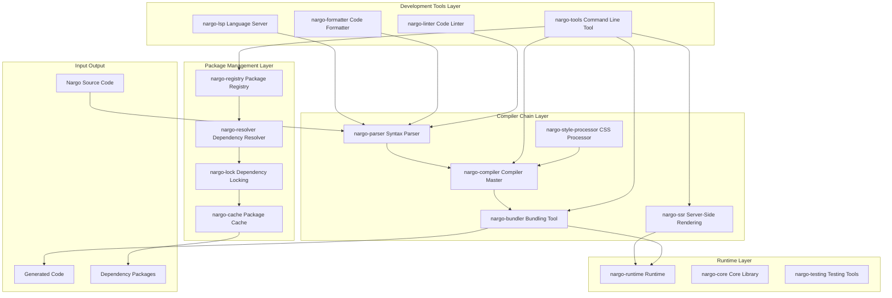
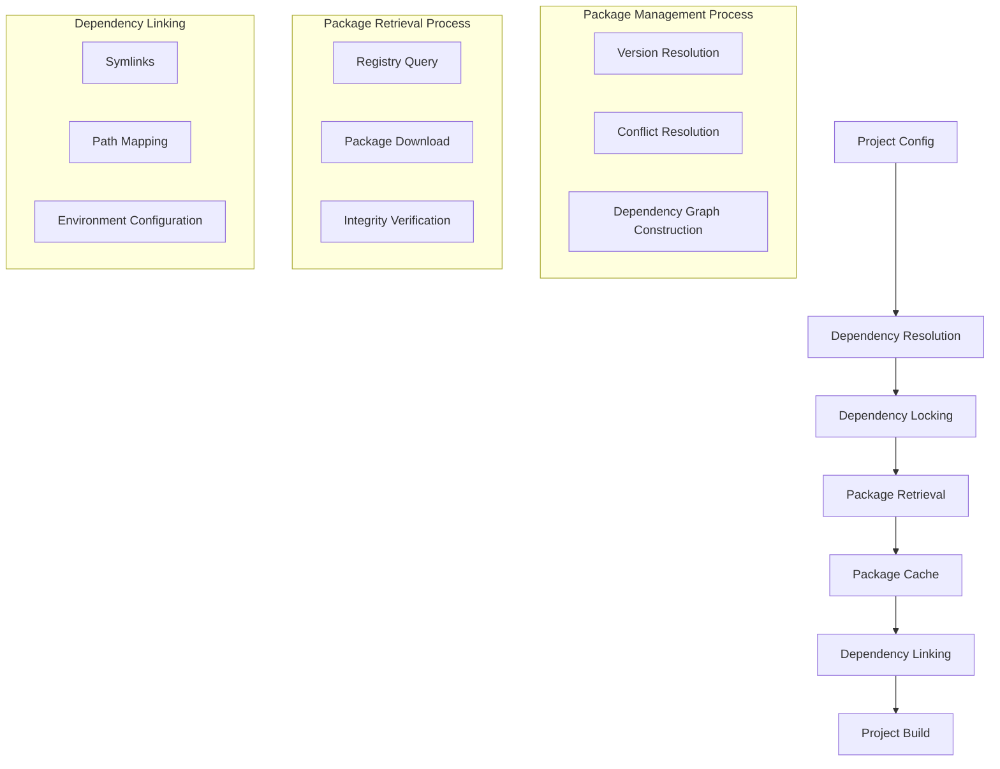
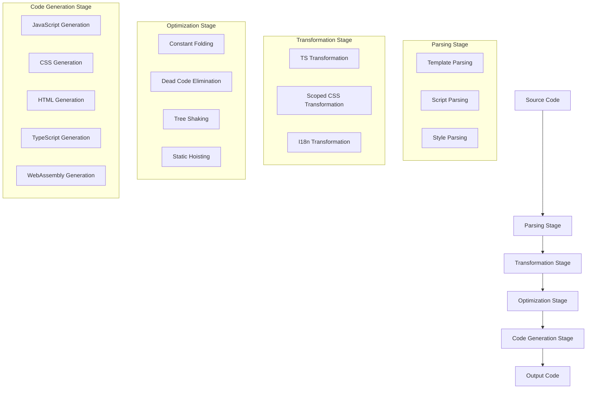
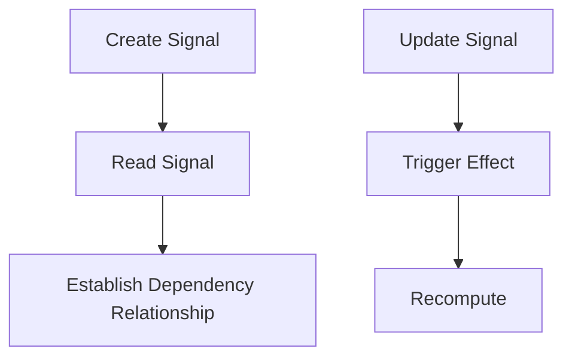

# Nargo System Architecture Documentation

## 1. Architecture Overview

Nargo is a revolutionary frontend development toolchain and package management system with a highly modular architecture design, focusing on providing a high-performance frontend development toolchain and package management solution. The entire system consists of four major parts: compiler chain, runtime, development tools, and package management, all implemented in Rust to provide extremely fast compilation and an excellent development experience.

### 1.1 Core Design Principles

- **Performance First**: Rust-based compiler chain and package management system, compilation speed 10-100x faster than traditional JS compilers
- **Package Management Innovation**: Completely replaces npm, pnpm, and other package management tools, managing TypeScript projects with cargo's approach, completely eliminating node_modules
- **Modular Design**: Clear responsibilities for each component, easy to maintain and extend
- **Multi-format Support**: Supports JavaScript, CSS, HTML, TypeScript type definitions, and WebAssembly code generation
- **Developer Experience**: Built-in Hot Module Replacement (HMR), providing a smooth development experience
- **Production Optimization**: All tool components are integrated into the Nargo package management system, without increasing production environment package size

## 2. System Architecture Diagram

## 3. Core Component Details

### 3.1 Package Management Layer

The Package Management Layer is Nargo's core innovation, responsible for replacing traditional package management tools and managing TypeScript projects with cargo's approach.

#### 3.1.1 nargo-registry

**Responsibility**: Package registry, managing package publishing and retrieval.

**Core Features**:
- Package publishing and retrieval
- Version management
- Package metadata management
- Multi-registry support
- Package signature verification

#### 3.1.2 nargo-resolver

**Responsibility**: Dependency resolver, resolving project dependencies.

**Core Features**:
- Dependency resolution
- Version conflict resolution
- Dependency graph construction
- Dependency analysis
- Incremental resolution

#### 3.1.3 nargo-lock

**Responsibility**: Dependency locking tool, ensuring dependency version consistency.

**Core Features**:
- Dependency version locking
- Lock file management
- Dependency verification
- Consistency checks
- Cross-platform consistency

#### 3.1.4 nargo-cache

**Responsibility**: Package cache, improving package installation speed.

**Core Features**:
- Package cache management
- Cache integrity verification
- Cache cleaning
- Offline installation support
- Shared cache

### 3.2 Compiler Chain

The Compiler Chain is responsible for compiling Nargo source code into efficient executable code.

#### 3.2.1 nargo-compiler

**Responsibility**: Compiler master, coordinating compilation stages, integrating nargo-parser, nargo-transformer, and other components.

**Core Features**:
- Manages compilation process, from source code to IR (Intermediate Representation) conversion
- Applies various optimizations and transformations
- Generates compilation results, including JavaScript, CSS, HTML, and WASM code
- Provides compilation statistics
- Incremental compilation support

#### 3.2.2 nargo-parser

**Responsibility**: Responsible for parsing Nargo syntax, including templates, CSS, JS, etc.

**Core Features**:
- Parses Nargo template syntax
- Parses TypeScript/JavaScript scripts
- Parses CSS/Tailwind styles
- Generates IR modules
- Syntax error reporting

#### 3.2.3 nargo-bundler

**Responsibility**: Bundling and build tool, supporting multi-format code generation, Hot Module Replacement, and incremental builds.

**Core Features**:
- Multi-format code generation (JavaScript, CSS, HTML, TypeScript, WebAssembly)
- Hot Module Replacement (HMR)
- Incremental builds
- Code splitting strategies
- Module dependency analysis
- Feature analysis
- Custom runtime generation

#### 3.2.4 nargo-ssr

**Responsibility**: Server-side rendering tool, including client hydration support.

**Core Features**:
- Server-side renders Nargo components
- Client hydration
- Prefetch data support
- Routing support
- Streaming rendering

#### 3.2.5 nargo-style-processor

**Responsibility**: CSS processing tool, supporting Tailwind and other CSS frameworks.

**Core Features**:
- Processes CSS styles
- Supports Tailwind syntax
- Scoped CSS processing
- CSS optimization
- CSS Modules support

### 3.3 Runtime

The Runtime provides core functionality required by Nargo applications, such as reactive systems, virtual DOM, etc.

#### 3.3.1 nargo-runtime

**Responsibility**: Provides core functionality required for Nargo application runtime.

**Core Features**:
- Reactive system (signals, effects, computed properties)
- Virtual DOM
- Component rendering
- Lifecycle management
- Internationalization support
- Lazy loading support
- Error boundaries

#### 3.3.2 nargo-core

**Responsibility**: Provides Nargo's core APIs and utility functions.

**Core Features**:
- Reactive APIs (signal, effect, computed)
- DOM manipulation APIs
- Component APIs
- Utility functions
- Algebraic effects

#### 3.3.3 nargo-testing

**Responsibility**: Provides testing helper functions, integrated into the Nargo package management system.

**Core Features**:
- Test application instance creation
- Transaction management
- Algebraic effects mocking
- Assertion tools
- DOM testing tools
- Test coverage

### 3.4 Development Tools

Development Tools provide various auxiliary functions to enhance the development experience.

#### 3.4.1 nargo-tools

**Responsibility**: Development tool set, including Language Server Protocol support, code checking and type checking, source mapping, documentation generation, and environment variable handling.

**Core Features**:
- Command-line tools (dev, build, test, add, remove, update, etc.)
- Environment variable handling
- Documentation generation
- Code checking
- Type checking
- Package management commands

#### 3.4.2 nargo-lsp

**Responsibility**: Language Server, providing IDE integration support.

**Core Features**:
- Code completion
- Syntax highlighting
- Error suggestions
- Definition navigation
- Code refactoring

#### 3.4.3 nargo-formatter

**Responsibility**: Code formatting tool.

**Core Features**:
- Code formatting
- Code style checking
- Auto-fixing

#### 3.4.4 nargo-linter

**Responsibility**: Code checking tool.

**Core Features**:
- Code quality checking
- Best practice checking
- Error detection
- Security checking

## 4. Package Management Process

Nargo's package management process is its core innovation, completely replacing traditional npm/pnpm package management:

1. **Dependency Declaration**: Declare dependencies in the project configuration file
2. **Dependency Resolution**: nargo-resolver resolves dependencies and builds dependency graph
3. **Dependency Locking**: Generates lock file to ensure dependency version consistency
4. **Package Retrieval**: Retrieves packages from registry and stores them in local cache
5. **Dependency Installation**: Links dependencies to the project, without generating node_modules
6. **Dependency Update**: Smartly updates dependencies, handling version conflicts

### 4.1 Package Management Flow Diagram

## 5. Compilation Process

Nargo's compilation process includes the following main stages:

1. **Parsing Stage**: Uses nargo-parser to parse Nargo source code, generating IR modules
2. **Transformation Stage**: Applies various transformations and optimizations to IR modules
3. **Optimization Stage**: Generates efficient code through compiler optimizations
4. **Code Generation Stage**: Generates final code based on target format

### 5.1 Compilation Flow Diagram

## 6. Hot Module Replacement (HMR) Process

Nargo's Hot Module Replacement process is as follows:

1. When starting the development server, also start the HMR server
2. The client connects to the HMR server
3. When file changes occur, the server recompiles the modified module
4. The server sends update notifications to the client via WebSocket
5. The client receives notifications and updates the module

## 7. Code Splitting Strategies

Nargo supports the following code splitting strategies:

- **SingleFile**: Single file bundling, no code splitting
- **ByRoute**: Split by route, each route generates a chunk
- **ByComponent**: Split by component, each component generates a chunk
- **Custom**: Custom splitting strategy

## 8. Runtime Architecture

Nargo's runtime architecture is based on the following core concepts:

- **Signal**: Core of reactive state management
- **Effect**: Handles side effects when state changes
- **Computed**: Derived state
- **Virtual DOM**: Efficient DOM updates
- **Component System**: Encapsulates UI logic
- **Algebraic Effects**: New way to handle side effects

### 8.1 Reactive System

Nargo's reactive system is based on a signal mechanism, achieving efficient state management through dependency tracking.

## 9. Configuration System

Nargo provides a flexible configuration system, supporting the following configuration items:

- **formatter**: Code formatting configuration
- **linter**: Code checking configuration
- **typecheck**: Type checking configuration
- **bundler**: Bundling configuration
- **ssr**: Server-side rendering configuration
- **registry**: Package registry configuration
- **resolver**: Dependency resolution configuration
- **cache**: Package cache configuration
- **workspace**: Workspace configuration

## 10. Extension System

Nargo supports extensions through a plugin system, with the main extension points including:

- **Parser Extensions**: Add new syntax parsers
- **Transformer Extensions**: Add new code transformations
- **Optimizer Extensions**: Add new code optimizations
- **Code Generation Extensions**: Add new code generation targets
- **Package Management Extensions**: Add new package management functionality
- **Registry Extensions**: Add new package registries
- **Command Extensions**: Add new command-line commands

## 11. Performance Optimization

Nargo achieves performance optimization through the following methods:

- **Rust-driven**: Uses Rust to implement core compilation logic and package management system, providing extreme performance
- **Incremental Compilation**: Only compiles modified modules, reducing compilation time
- **Parallel Compilation**: Leverages multi-core advantages, processing multiple modules in parallel
- **Compile-time Optimization**: Generates efficient code through compile-time analysis and optimization
- **Tree Shaking**: Removes unused code, reducing package size
- **On-demand Generation**: Generates minimal runtime based on used features
- **Package Cache**: Caches downloaded packages, improving installation speed
- **Dependency Resolution Optimization**: Efficient dependency resolution algorithms, reducing dependency analysis time
- **Symlinks**: Uses symlinks instead of copying, reducing disk usage
- **Workspace Management Optimization**: Enhances workspace loading and management performance through caching, parallel loading, and lazy loading

### 11.1 Workspace Management Performance Optimization

Nargo's workspace management system has been optimized for performance, especially for large projects:

#### 11.1.1 Caching Mechanism
- **Workspace Cache**: Caches workspace structure and configuration to avoid repeated discovery and parsing
- **Dependency Cache**: Caches shared dependencies across workspace members
- **Config Cache**: Caches workspace configuration to reduce file I/O operations

#### 11.1.2 Parallel Loading
- **Parallel Member Discovery**: Discovers workspace members in parallel using tokio
- **Parallel Dependency Loading**: Loads dependencies in parallel to reduce loading time
- **Batch Processing**: Processes workspace members in batches for efficient handling

#### 11.1.3 Lazy Loading
- **Lazy Member Loading**: Loads workspace members on-demand instead of all at once
- **Pending Members**: Maintains a list of pending members to load incrementally
- **Selective Loading**: Loads only necessary members based on user actions

#### 11.1.4 Dependency Sharing
- **Shared Dependencies**: Identifies and caches dependencies shared across workspace members
- **Dependency Resolution Cache**: Caches dependency resolution results to avoid repeated resolution
- **Efficient Dependency Merging**: Merges dependencies efficiently to reduce redundant processing

#### 11.1.5 Configuration Management
- **Efficient Config Merging**: Merges configuration from multiple sources efficiently
- **Config Caching**: Caches merged configuration to avoid repeated parsing
- **Selective Config Loading**: Loads only necessary configuration sections

#### 11.1.6 Large Workspace Handling
- **Batch Processing**: Processes large workspaces in batches to avoid memory issues
- **Incremental Updates**: Updates workspace state incrementally instead of rebuilding from scratch
- **Memory Optimization**: Optimizes memory usage for large workspaces

These optimizations ensure that Nargo can handle large workspaces with hundreds of packages efficiently, providing a smooth development experience even for complex projects.

## 12. Summary

Nargo adopts a highly modular architecture design, providing extreme performance through a Rust-driven compiler chain and package management system, while providing rich development tools and runtime functionality. This design enables Nargo to replace traditional frontend development tools and package management tools, providing a more efficient and smoother development experience.

Nargo's core advantages are:
- **Package Management Innovation**: Completely replaces npm, pnpm, and other package management tools, managing TypeScript projects with cargo's approach, completely eliminating node_modules
- **Extremely Fast Compilation**: Rust-based high-performance compiler chain
- **Rich Functionality**: Integrates the features of various frontend development tools
- **Great Experience**: Hot Module Replacement and smooth development workflow
- **Production Optimization**: Minimal runtime and package size
- **Extensibility**: Modular design and plugin system

Through this architectural design, Nargo provides a modern and efficient toolchain and package management solution for frontend development, and is expected to become the mainstream choice for frontend development in the future.
