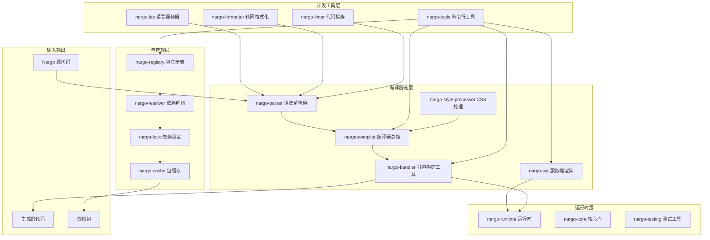
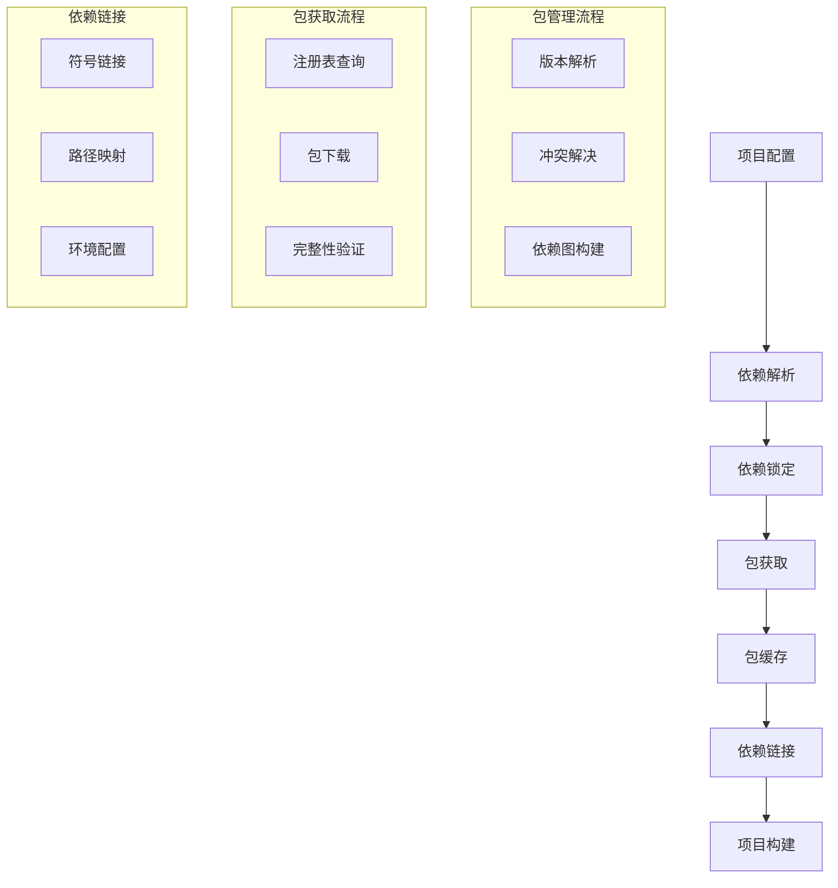
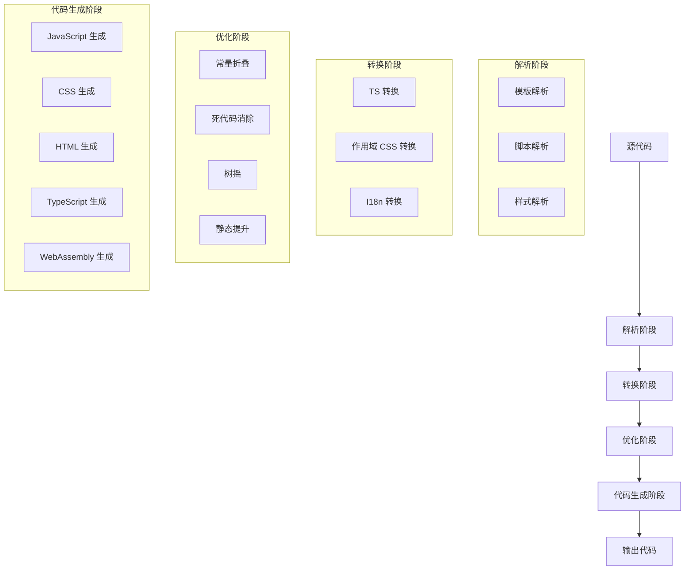
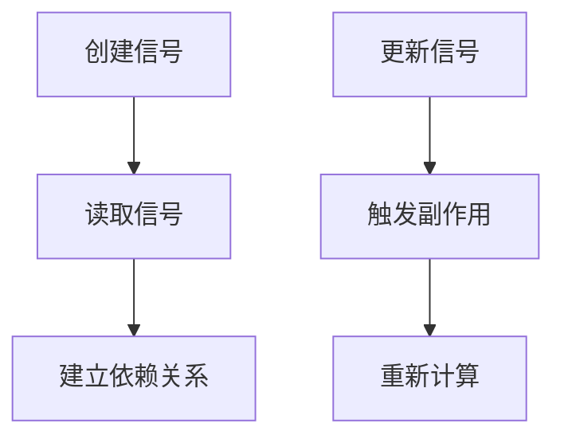
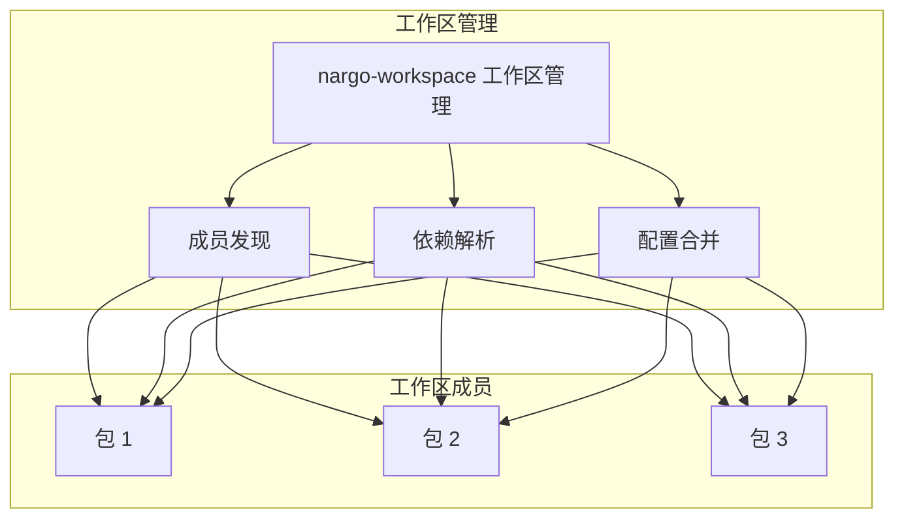

# Nargo 系统架构文档

## 1. 架构概述

Nargo 是一个革命性的前端开发工具链和包管理系统，采用高度模块化的架构设计，专注于提供高性能的前端开发工具链和包管理解决方案。整个系统由编译器链、运行时、开发工具和包管理四大部分组成，以 Rust 为核心实现，提供极速编译和卓越的开发体验。

### 1.1 核心设计理念

- **性能优先**：基于 Rust 实现的编译器链和包管理系统，编译速度比传统 JS 编译器快 10-100 倍
- **包管理创新**：完全替代 npm、pnpm 等包管理工具，使用 cargo 思路管理 TypeScript 项目，完全移除 node_modules
- **模块化设计**：各个组件职责清晰，易于维护和扩展
- **多格式支持**：支持 JavaScript、CSS、HTML、TypeScript 类型定义和 WebAssembly 代码生成
- **开发体验**：内置热模块替换 (HMR)，提供流畅的开发体验
- **生产优化**：所有工具组件都集成在 Nargo 包管理系统中，不会增加生产环境的包体积

## 2. 系统架构图

## 3. 核心组件详解

### 3.1 包管理层 (Package Management)

包管理层是 Nargo 的核心创新，负责替代传统的包管理工具，使用 cargo 思路管理 TypeScript 项目。

#### 3.1.1 nargo-registry

**职责**：包注册表，管理包的发布和获取。

**核心功能**：
- 包发布和获取
- 版本管理
- 包元数据管理
- 多注册表支持
- 包签名验证

#### 3.1.2 nargo-resolver

**职责**：依赖解析器，解析项目依赖。

**核心功能**：
- 依赖解析
- 版本冲突解决
- 依赖图构建
- 依赖分析
- 增量解析

#### 3.1.3 nargo-lock

**职责**：依赖锁定工具，确保依赖版本一致性。

**核心功能**：
- 依赖版本锁定
- 锁定文件管理
- 依赖验证
- 一致性检查
- 跨平台一致性

#### 3.1.4 nargo-cache

**职责**：包缓存，提高包安装速度。

**核心功能**：
- 包缓存管理
- 缓存完整性验证
- 缓存清理
- 离线安装支持
- 共享缓存

### 3.2 编译器链 (Compilers)

编译器链负责将 Nargo 源代码编译为高效的可执行代码。

#### 3.2.1 nargo-compiler

**职责**：编译器总控，协调各个编译阶段，集成 nargo-parser、nargo-transformer 等组件。

**核心功能**：
- 管理编译流程，从源代码到 IR（中间表示）的转换
- 应用各种优化和转换
- 生成编译结果，包括 JavaScript、CSS、HTML 和 WASM 代码
- 提供编译统计信息
- 增量编译支持

#### 3.2.2 nargo-parser

**职责**：负责解析 Nargo 语法，包括模板、CSS、JS 等。

**核心功能**：
- 解析 Nargo 模板语法
- 解析 TypeScript/JavaScript 脚本
- 解析 CSS/Tailwind 样式
- 生成 IR 模块
- 语法错误报告

#### 3.2.3 nargo-bundler

**职责**：打包构建工具，支持多格式代码生成、热模块替换和增量构建。

**核心功能**：
- 多格式代码生成（JavaScript、CSS、HTML、TypeScript、WebAssembly）
- 热模块替换 (HMR)
- 增量构建
- 代码分割策略
- 模块依赖分析
- 特征分析
- 自定义运行时生成

#### 3.2.4 nargo-ssr

**职责**：服务端渲染工具，包含客户端 hydration 支持。

**核心功能**：
- 服务端渲染 Nargo 组件
- 客户端 hydration
- 预取数据支持
- 路由支持
- 流式渲染

#### 3.2.5 nargo-style-processor

**职责**：CSS 处理工具，支持 Tailwind 等 CSS 框架。

**核心功能**：
- 处理 CSS 样式
- 支持 Tailwind 语法
- 作用域 CSS 处理
- CSS 优化
-  CSS 模块支持

### 3.3 运行时 (Runtimes)

运行时提供 Nargo 应用所需的核心功能，如响应式系统、虚拟 DOM 等。

#### 3.3.1 nargo-runtime

**职责**：提供 Nargo 应用运行所需的核心功能。

**核心功能**：
- 响应式系统（信号、副作用、计算属性）
- 虚拟 DOM
- 组件渲染
- 生命周期管理
- 国际化支持
- 懒加载支持
- 错误边界

#### 3.3.2 nargo-core

**职责**：提供 Nargo 的核心 API 和工具函数。

**核心功能**：
- 响应式 API（signal、effect、computed）
- DOM 操作 API
- 组件 API
- 工具函数
- 代数效应

#### 3.3.3 nargo-testing

**职责**：提供测试辅助函数，集成在 Nargo 包管理系统中。

**核心功能**：
- 测试应用实例创建
- 事务管理
- 代数效应 mock
- 断言工具
- DOM 测试工具
- 测试覆盖率

### 3.4 开发工具 (Tools)

开发工具提供各种辅助功能，提升开发体验。

#### 3.4.1 nargo-tools

**职责**：开发工具集合，包含语言服务器协议支持、代码检查和类型检查、源码映射、文档生成和环境变量处理等功能。

**核心功能**：
- 命令行工具（dev、build、test、add、remove、update 等）
- 环境变量处理
- 文档生成
- 代码检查
- 类型检查
- 包管理命令

#### 3.4.2 nargo-lsp

**职责**：语言服务器，提供 IDE 集成支持。

**核心功能**：
- 代码补全
- 语法高亮
- 错误提示
- 定义跳转
- 代码重构

#### 3.4.3 nargo-formatter

**职责**：代码格式化工具。

**核心功能**：
- 代码格式化
- 代码风格检查
- 自动修复

#### 3.4.4 nargo-linter

**职责**：代码检查工具。

**核心功能**：
- 代码质量检查
- 最佳实践检查
- 错误检测
- 安全检查

## 4. 包管理流程

Nargo 的包管理流程是其核心创新，完全替代了传统的 npm/pnpm 包管理方式：

1. **依赖声明**：在项目配置文件中声明依赖
2. **依赖解析**：nargo-resolver 解析依赖关系，构建依赖图
3. **依赖锁定**：生成锁定文件，确保依赖版本一致性
4. **包获取**：从注册表获取包，存储到本地缓存
5. **依赖安装**：将依赖链接到项目，不生成 node_modules
6. **依赖更新**：智能更新依赖，处理版本冲突

### 4.1 包管理流程图

## 5. 编译流程

Nargo 的编译流程包括以下几个主要阶段：

1. **解析阶段**：使用 nargo-parser 解析 Nargo 源代码，生成 IR 模块
2. **转换阶段**：对 IR 模块应用各种转换和优化
3. **优化阶段**：通过编译器优化生成高效的代码
4. **代码生成阶段**：根据目标格式生成最终代码

### 5.1 编译流程图

## 6. 热模块替换 (HMR) 流程

Nargo 的热模块替换流程如下：

1. 启动开发服务器时，同时启动 HMR 服务器
2. 客户端连接到 HMR 服务器
3. 当文件发生变化时，服务器重新编译修改的模块
4. 服务器通过 WebSocket 向客户端发送更新通知
5. 客户端接收通知并更新模块

## 7. 代码分割策略

Nargo 支持以下代码分割策略：

- **SingleFile**：单文件打包，不进行代码分割
- **ByRoute**：按路由分割，每个路由生成一个 chunk
- **ByComponent**：按组件分割，每个组件生成一个 chunk
- **Custom**：自定义分割策略

## 8. 运行时架构

Nargo 的运行时架构基于以下核心概念：

- **信号 (Signal)**：响应式状态管理的核心
- **副作用 (Effect)**：处理状态变化时的副作用
- **计算属性 (Computed)**：派生状态
- **虚拟 DOM**：高效的 DOM 更新
- **组件系统**：封装 UI 逻辑
- **代数效应**：处理副作用的新方式

### 8.1 响应式系统

Nargo 的响应式系统基于信号机制，通过依赖追踪实现高效的状态管理。

## 9. 配置系统

Nargo 提供了灵活的配置系统，支持以下配置项：

- **formatter**：代码格式化配置
- **linter**：代码检查配置
- **typecheck**：类型检查配置
- **bundler**：打包配置
- **ssr**：服务端渲染配置
- **registry**：包注册表配置
- **resolver**：依赖解析配置
- **cache**：包缓存配置
- **workspace**：工作区配置

## 10. 扩展系统

Nargo 支持通过插件系统进行扩展，主要扩展点包括：

- **解析器扩展**：添加新的语法解析器
- **转换器扩展**：添加新的代码转换
- **优化器扩展**：添加新的代码优化
- **代码生成扩展**：添加新的代码生成目标
- **包管理扩展**：添加新的包管理功能
- **注册表扩展**：添加新的包注册表
- **命令扩展**：添加新的命令行命令

## 11. 性能优化

Nargo 通过以下方式实现性能优化：

- **Rust 驱动**：使用 Rust 实现核心编译逻辑和包管理系统，提供极致性能
- **增量编译**：只编译修改的模块，减少编译时间
- **并行编译**：利用多核优势，并行处理多个模块
- **编译期优化**：通过编译期分析和优化，生成高效的代码
- **树摇**：移除未使用的代码，减少包体积
- **按需生成**：根据使用的功能生成最小化的运行时
- **包缓存**：缓存已下载的包，提高安装速度
- **依赖解析优化**：高效的依赖解析算法，减少依赖分析时间
- **符号链接**：使用符号链接替代复制，减少磁盘使用
- **工作区管理优化**：通过缓存、并行加载和懒加载提升工作区加载和管理性能

### 11.1 工作区管理性能优化

Nargo 的工作区管理系统针对性能进行了优化，特别是对于大型项目：

#### 11.1.1 缓存机制
- **工作区缓存**：缓存工作区结构和配置，避免重复发现和解析
- **依赖缓存**：缓存工作区成员之间的共享依赖
- **配置缓存**：缓存工作区配置，减少文件 I/O 操作

#### 11.1.2 并行加载
- **并行成员发现**：使用 tokio 并行发现工作区成员
- **并行依赖加载**：并行加载依赖，减少加载时间
- **批量处理**：批量处理工作区成员，提高处理效率

#### 11.1.3 懒加载
- **成员懒加载**：按需加载工作区成员，而不是一次性全部加载
- **待处理成员**：维护待加载成员列表，增量加载
- **选择性加载**：根据用户操作只加载必要的成员

#### 11.1.4 依赖共享
- **共享依赖**：识别并缓存工作区成员之间的共享依赖
- **依赖解析缓存**：缓存依赖解析结果，避免重复解析
- **高效依赖合并**：高效合并依赖，减少冗余处理

#### 11.1.5 配置管理
- **高效配置合并**：高效合并来自多个源的配置
- **配置缓存**：缓存合并后的配置，避免重复解析
- **选择性配置加载**：只加载必要的配置部分

#### 11.1.6 大型工作区处理
- **批量处理**：批量处理大型工作区，避免内存问题
- **增量更新**：增量更新工作区状态，而不是从头重建
- **内存优化**：优化大型工作区的内存使用

这些优化确保 Nargo 能够高效处理包含数百个包的大型工作区，即使对于复杂项目也能提供流畅的开发体验。

## 12. 工作区管理

Nargo 的工作区管理系统允许开发者在一个代码库中管理多个相关的包，特别适合大型项目和 monorepo 结构。

### 12.1 工作区架构

### 12.2 工作区核心功能

#### 12.2.1 成员发现
- 自动发现工作区中的所有包
- 支持通配符模式（如 `packages/*`）
- 递归扫描子目录
- 缓存工作区结构，提高性能

#### 12.2.2 依赖管理
- 共享依赖：工作区成员可以共享依赖版本
- 依赖解析：智能解析工作区内部和外部依赖
- 依赖冲突解决：自动解决依赖版本冲突
- 依赖图构建：构建完整的依赖图，确保一致性

#### 12.2.3 配置管理
- 继承配置：工作区成员可以继承工作区配置
- 配置合并：智能合并工作区和包级配置
- 环境变量：支持工作区级别的环境变量
- 共享脚本：支持工作区级别的脚本定义

#### 12.2.4 命令执行
- 批量执行：在所有工作区成员中执行命令
- 过滤执行：只在特定工作区成员中执行命令
- 并行执行：并行执行命令，提高效率
- 依赖顺序：按照依赖顺序执行命令

### 12.3 工作区性能优化

Nargo 的工作区管理系统针对性能进行了优化，特别是对于大型项目：

#### 12.3.1 缓存机制
- **工作区缓存**：缓存工作区结构和配置，避免重复发现和解析
- **依赖缓存**：缓存工作区成员之间的共享依赖
- **配置缓存**：缓存工作区配置，减少文件 I/O 操作

#### 12.3.2 并行加载
- **并行成员发现**：使用 tokio 并行发现工作区成员
- **并行依赖加载**：并行加载依赖，减少加载时间
- **批量处理**：批量处理工作区成员，提高处理效率

#### 12.3.3 懒加载
- **成员懒加载**：按需加载工作区成员，而不是一次性全部加载
- **待处理成员**：维护待加载成员列表，增量加载
- **选择性加载**：根据用户操作只加载必要的成员

#### 12.3.4 依赖共享
- **共享依赖**：识别并缓存工作区成员之间的共享依赖
- **依赖解析缓存**：缓存依赖解析结果，避免重复解析
- **高效依赖合并**：高效合并依赖，减少冗余处理

#### 12.3.5 配置管理
- **高效配置合并**：高效合并来自多个源的配置
- **配置缓存**：缓存合并后的配置，避免重复解析
- **选择性配置加载**：只加载必要的配置部分

#### 12.3.6 大型工作区处理
- **批量处理**：批量处理大型工作区，避免内存问题
- **增量更新**：增量更新工作区状态，而不是从头重建
- **内存优化**：优化大型工作区的内存使用

这些优化确保 Nargo 能够高效处理包含数百个包的大型工作区，即使对于复杂项目也能提供流畅的开发体验。

## 13. 总结

Nargo 采用高度模块化的架构设计，通过 Rust 驱动的编译器链和包管理系统提供极致性能，同时提供丰富的开发工具和运行时功能。这种设计使得 Nargo 能够替代传统的前端开发工具和包管理工具，提供更高效、更流畅的开发体验。

Nargo 的核心优势在于：
- **包管理创新**：完全替代 npm、pnpm 等包管理工具，使用 cargo 思路管理 TypeScript 项目，完全移除 node_modules
- **极速编译**：基于 Rust 的高性能编译器链
- **丰富功能**：集成了多种前端开发工具的功能
- **良好体验**：热模块替换和流畅的开发流程
- **生产优化**：最小化的运行时和包体积
- **可扩展性**：模块化设计和插件系统
- **工作区管理**：高效的多包项目管理

通过这种架构设计，Nargo 为前端开发提供了一个现代化、高效的工具链和包管理解决方案，有望成为未来前端开发的主流选择。