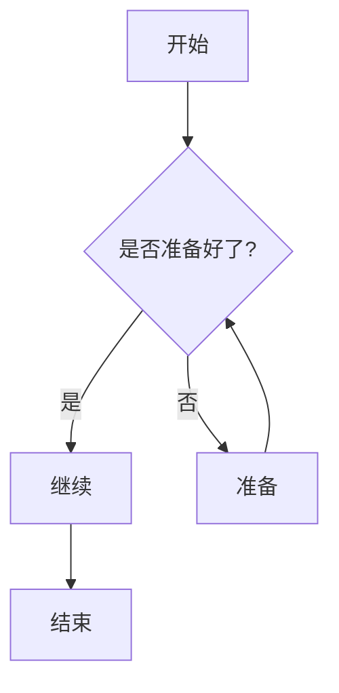

# 欢迎使用 Nargo Document

这是一个 Nargo Document 的示例文档站点。

## 快速开始

Nargo Document 是一个强大的文档生成工具，支持：

- Markdown 文档编写
- 多种输出格式（HTML、Markdown、PDF）
- 丰富的插件系统
- 灵活的主题定制

## 功能特性

:::tip
提示：这是一个提示信息
:::

:::warning
警告：这是一个警告信息
:::

## 代码示例

```rust
fn main() {
    println!("Hello, Nargo Document!");
}
```

## 数学公式

行内公式：$E=mc^2$

块级公式：

$$
\sum_{i=1}^n i = \frac{n(n+1)}{2}
$$

## 图表


